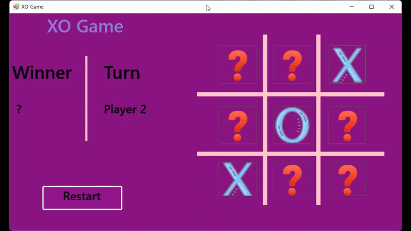

<div align="center">

# ❌⭕ Game Windows Forms

</div>

A simple, and fully functional implementation of the classic XO game using **C# WinForms**. This project allows two players to compete on the same machine with intuitive graphics.

---

---

## 🧩 Features

- 🎯 Two-player support: Player 1 vs Player 2.
- ✅ Win detection: Horizontal, Vertical, and Diagonal.
- 🔁 Restart Game functionality.
- 🎨 Visual grid drawn using custom painting.
- 🖼️ Icons for player marks (X and O) using image resources.
- 📋 Clear UI to show current player's turn and winner.

---

## 🧠 Project Structure
```bash
├── Properties/
│   └── Resources.resx  # Contains X, O, and question mark images
├── Form1.cs            # Main game logic
├── Program.cs          # Entry point
├── README.md
└── ... other standard WinForms files
```

---

## 🎮 Gameplay Demo

<div align="center">



</div>

## 🖥️ Technologies Used

- C# (.NET Framework)
- Windows Forms (WinForms)
- Custom Drawing with GDI+
- Visual Studio IDE

---

## 🛠️ How to Run the Game

1. Clone the repository:
   ```bash
   git clone https://github.com/M7md-Galal/X-O_Game.git
